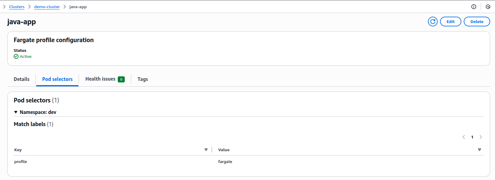
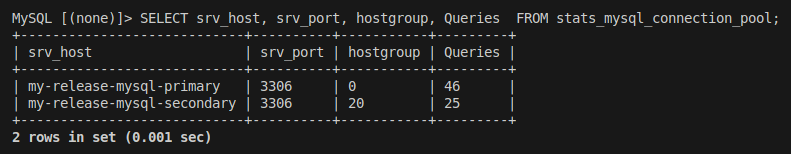

# Kubernetes Helm Java App (EKS, Fargate, MySQL, ProxySQL)

This repo deploys:
- Java app on EKS Fargate (dev namespace) via Helm
- MySQL on EC2 node group (1 primary, 2 replicas)
- ProxySQL in front of MySQL
- CI/CD via Jenkins + Helm
- Autoscaling via HPA
- Ingress for external access

## Architecture


- App runs on Fargate (serverless nodes).
- MySQL runs on EC2-backed node group for local storage/IO (EBS).
- ProxySQL provides RW/RO routing and failover.
- HPA scales app pods; Fargate provides capacity automatically.

## Repository layout

- `HelmChart/` – app Helm chart (Deployment, Service, Ingress, HPA, Secrets/Config)
- `k8s-deployment/` – raw manifests and supporting values (MySQL chart values, RBAC, StorageClass, etc.)
- `kubernetes/proxysql-*` – ProxySQL Helm charts/config

## Helm chart (app)

Key values (`HelmChart/values-override.yaml`):
- `appName`, `namespace`
- `imageRepository`, `imageTag`, `registrySecret`
- `containerPort`, `servicePort`
- `secretData`: DB_USER, DB_PWD, DB_NAME, MYSQL_ROOT_PASS (chart uses stringData; provide secret text in CI)
- `configData`: DB_SERVER (e.g., `proxysql-cluster.default.svc.cluster.local`)
- `hpa`: enabled, minReplicas, maxReplicas, cpu.targetPercentage, behavior
- `ingress`: host, tls, annotations

Install or upgrade:
```bash
helm upgrade --install my-app ./HelmChart \
  -f HelmChart/values-override.yaml \
  -n dev --create-namespace
```

Validate:
```bash
helm lint ./HelmChart -f HelmChart/values-override.yaml
helm template my-app ./HelmChart -f HelmChart/values-override.yaml
kubectl -n dev rollout status deploy/java-maven-app
```

## Autoscaling (HPA)

- Requires Metrics Server add-on.
- Chart creates `autoscaling/v2` HPA when `hpa.enabled=true`.
- When HPA is enabled:
  - Set Deployment replicas to `minReplicas` or omit replicas to avoid drift.
  - Default CPU target 70%; add memory metric optionally.

HPA status:
```bash
kubectl -n dev get hpa
kubectl -n dev describe hpa java-maven-app
kubectl -n dev top pods
```

## Ingress

- Uses your cluster’s Ingress controller (AWS Load Balancer Controller or NGINX).
- Configure host/tls in values; controller must be installed.
- Validate DNS and certificate if TLS is enabled.

## MySQL on EC2 nodes (Bitnami)

- Replication mode: 1 primary, 2 replicas (`k8s-deployment/mysql-chart-values.yaml`).
- Storage: EBS via the EBS CSI driver and a `StorageClass` (see `k8s-deployment/storage-class.yaml`). Values reference `gp3`.
- Custom MySQL config: `k8s-deployment/my_conf` contains a file enabling:
  ```
  [mysqld]
  caching_sha2_password_auto_generate_rsa_keys=ON
  ```
- App connects via ProxySQL, not directly to MySQL.

Deploy/upgrade MySQL (example):
```bash
helm upgrade --install my-release bitnami/mysql \
  -n default -f k8s-deployment/mysql-chart-values.yaml
```

## ProxySQL

- Listener 6033 (MySQL) and admin 6032 (Admin interface).
- Config file example (`kubernetes/proxysql-cluster/files/proxysql.cnf`):
  - `admin_variables.admin_credentials`: `admin:admin;radmin:radmin` (admin only, port 6032)
  - `mysql_servers`: writer hostgroup (e.g., 0 or 10) and reader hostgroup (e.g., 20) with primary/replica services
  - `mysql_users`: application user with `default_hostgroup` pointing to writer
  - `mysql_query_rules`: routes `SELECT` to readers, others to writer
  - `mysql_replication_hostgroups`: maps writer/reader HGs


Auth note:
- Prefer ProxySQL ≥ `2.6.x` for MySQL 8 `caching_sha2_password`.
- Otherwise use `mysql_native_password` on the DB user if supported by your MySQL build.

## Jenkins CI/CD (Jenkins on EC2, outside cluster)

- Pipeline builds with Gradle, builds/pushes Docker to ECR, and deploys with Helm.
- Jenkins connects to the cluster using a kubeconfig and aws-auth mapping.
- Store DB credentials in Jenkins Credentials (secret text); chart uses `stringData` so Kubernetes encodes them.

Kubernetes RBAC for Jenkins (`k8s-deployment/jenkins-clusterrole.yaml`, `k8s-deployment/jenkins-clusterrole-binding.yaml`):
- Allows managing Deployments, Services, Ingresses, ConfigMaps, Secrets in target namespaces.
- Bind the ClusterRole to the Jenkins Kubernetes identity.

## AWS access via EKS Pod Identity (cluster add-ons) and Fargate role

- Used EKS Pod Identity (not IRSA) to grant AWS to in-cluster components (e.g., EBS CSI controller). Steps done via AWS Console.
- Ensure:
  - EKS Pod Identity Agent add-on is installed (Console: Add-ons → Amazon EKS Pod Identity Agent).
  - Associate IAM roles to service accounts (Console: Cluster → Access → Pod Identity Associations) such as:
    - EBS CSI controller SA with `AmazonEBSCSIDriverPolicy`.
  - Fargate profile uses a Pod Execution Role with:
    - `AmazonEKSFargatePodExecutionRolePolicy`
    - `AmazonEC2ContainerRegistryReadOnly`
    - optional CloudWatch Logs permissions.

Note: Jenkins is outside the cluster on EC2; use an instance profile role granting ECR (push/pull) and EKS (cluster access) per your security policy. These were configured via the AWS Console.

## Deploy sequence (from scratch)

1) Pre-reqs:
- EKS cluster + node group (for MySQL)
- Fargate profile (namespace `dev`)
- Metrics Server add-on
- EBS CSI driver add-on + StorageClass
- Pod Identity Agent add-on + Pod Identity associations (EBS CSI, etc.)

2) Databases:
```bash
helm upgrade --install my-release bitnami/mysql -n default -f k8s-deployment/mysql-chart-values.yaml
```

3) ProxySQL:
- Update `kubernetes/proxysql-*/files/proxysql.cnf` (servers/users/hostgroups)
- Deploy chart and load/persist config via Admin (6032)

4) App:
```bash
helm upgrade --install my-app ./HelmChart -f HelmChart/values-override.yaml -n dev --create-namespace
kubectl -n dev get deploy,svc,hpa,ingress
```

## Security notes

- Keep DB credentials in Jenkins Credentials (secret text). The chart uses `stringData`.
- Scope Jenkins RBAC to target namespaces.
- Prefer upgrading ProxySQL for modern MySQL auth.

## Screenshots 

- Fargate profile (namespace `dev`)

- Jenkins job stages (build, push, deploy)

- HPA status (describe)

- ProxySQL runtime servers (6032 admin)



- App logs: kubectl -n dev logs deploy/java-maven-app -f
- HPA: kubectl -n dev describe hpa java-maven-app
- ProxySQL admin: kubectl -n default port-forward svc/<proxysql-svc> 6032:6032
- DB secrets (raw manifest example): k8s-deployment/db-secrets.yaml

## Security notes

- Keep DB credentials in Jenkins credentials (secret text). Helm chart uses stringData; Kubernetes encodes them.
- Limit Jenkins RBAC to target namespaces only.
- Rotate ECR and DB credentials regularly.
- Prefer upgrading ProxySQL for modern MySQL auth instead of weakening DB auth.
